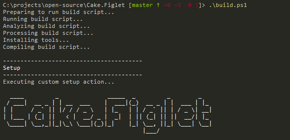

# Cake.Figlet

Cake.Figlet adds FIGlet font support to Cake allowing superfulous Ascii art to be added
to your build scripts easily.



[](https://ci.appveyor.com/project/enkafan/cake-figlet/branch/master) [](https://www.nuget.org/packages/cake.figlet) [](https://www.codefactor.io/repository/github/cake-contrib/cake.figlet)

## Referencing

Reference the library directly in your build script via a cake addin directive:

```
#addin "Cake.Figlet"
```

## Usage

```
Setup(ctx => {
    Information("");
    Information(Figlet("Cake.Figlet"));
});
```

This will output
```
----------------------------------------
Setup
----------------------------------------
Executing custom setup action...

  ____         _              _____  _         _        _
 / ___|  __ _ | | __  ___    |  ___|(_)  __ _ | |  ___ | |_
| |     / _` || |/ / / _ \   | |_   | | / _` || | / _ \| __|
| |___ | (_| ||   < |  __/ _ |  _|  | || (_| || ||  __/| |_
 \____| \__,_||_|\_\ \___|(_)|_|    |_| \__, ||_| \___| \__|
                                        |___/

```

## Thanks

Figlet code is based heavily from [Philippe Auriou's FIGlet library](https://github.com/auriou/FIGlet)

